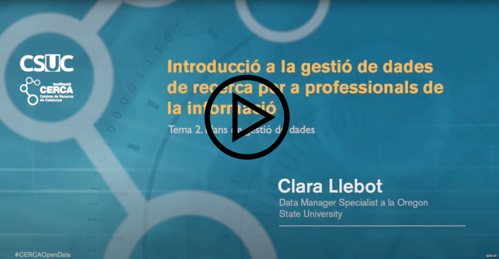

Aquesta lliçó conté el següent contingut:

* Plans de gestió de dades a Espanya i Catalunya
* Què és un pla de gestió de dades?
* Què s'ha d'escriure en un pla de gestió de dades?
* Plans de gestió de dades en projectes amb subjectes humans i la GDPR

Podeu mirar el vídeo, o llegir aquesta pàgina, hi ha el mateix contingut. La única diferència és que a la lliçó escrita trobareu preguntes vertader/fals i lectures recomanades que no són al vídeo (en requadres taronja). Al final de la lliçó (només en el text, no en el vídeo) també trobareu recursos per trobar exemples de plans de gestió de dades fets per contextos diferents, de disciplines diferents. El vídeo dura 36 minuts.

# Plans de gestió de dades a Espanya i Catalunya

### Projectes europeus

Aquest és l'escenari més comú a Espanya per necessitar un pla de gestió de dades. Investigadors participant o dirigint un projecte europeu.
En l'àmbit geogràfic d'Espanya la Comissió Europea ha estat la que ha assumit el paper d'impulsar i fomentar l'accés obert a la ciència i les dades de recerca. Al programa Horizon 2020 es va establir un pla pilot per a les dades d'investigació. Segons aquest pla algunes disciplines havien de presentar un pla de gestió de dades, i havien de posar les seves dades en accés obert (a més de posar en obert també les publicacions). Al gener 2017 el pilot es va estendre a totes les àrees de el programa marc. Quan un projecte és finançat, ha de redactar un pla de gestió de dades al llarg de l'execució de el projecte. Aquest pla de gestió de dades ha de donar detalls sobre les dades que es generaran, com es compartiran (o si no es compartiran, per quins motius), i com es preservaran. Per a més informació sobre el context a la Unió Europea podeu consultar l'informe de Maredata ([Melero, 2018](http://hdl.handle.net/10609/98347)).

### Projectes externs, finançats per agències (públiques o privades) que requereixen plans de gestió de dades.

Hi ha molts investigadors i investigadores que col·laboren en projectes amb col·laboradors d'arreu de món, i pot ser que agències d'altres països o agències privades tinguin requeriments que incloguin redactar un pla de gestió de dades, i posar les dades en obert.
Per exemple, la Gran Bretanya ha estat un apionera en parlar de dades de recerca. Canadà fa poc que ha publicat una política que obliga a redactar plans de gestió de dades als investigadors que demanin certs tipus de projectes. Als Estats units el National Institutes of Health (NIH) va començar a requerir el que ells anomenaven Data Sharing Plans en 2003. En 2011 la National Science Foundation va començar a requerir Plans de Gestió de Dades. El 2013 la casa blanca va publicar un memoràndum ([OSTP, 2013](https://obamawhitehouse.archives.gov/blog/2013/02/22/expanding-public-access-results-federally-funded-research)) que deia que les agències federals amb altes despeses en investigació havien de fer plans per assegurar que els productes de les investigacions que finançaven (incloses les dades) es farien públics. La majoria van començar a requerir plans de gestió de dades. Podeu consultar aquests plans al web de SPARC [http://researchsharing.sparcopen.org/data](http://researchsharing.sparcopen.org/data)
Les agències de finançament privades moltes vegades també requereixen plans de gestió de dades. 

### Projectes nacionals

D'això en sabeu més vosaltres que jo! Pel que tinc entès, sembla que hi ha plans per començar a exigir plans de gestió de dades per a projectes nacionals, però que el requeriment és molt vague. A la convocatòria de Novembre del 2020 ([aquí](http://www.aei.gob.es/portal/site/MICINN/menuitem.791459a43fdf738d70fd325001432ea0/?vgnextoid=3ba6fbd0ce7f4710VgnVCM1000001d04140aRCRD&vgnextchannel=b24e067c468a4610VgnVCM1000001d04140aRCRD&vgnextfmt=formato2&id3=d42265fd91705710VgnVCM1000001d04140a____)) hi deia això:

* A la part de Contenido y documentación de la solicitud (article 14) no hi diu res de plans de gestió de dades. Com a novetat del 2021 sí que hi diu que les Obligaciones de las entidades beneficiarias (article 19) inclouen “Los datos de investigación se deberán depositar en repositorios institucionales, nacionales y/o internacionales antes de que transcurran dos años desde la finalización del proyecto, con el fin de impulsar el acceso a datos de investigación de las ayudas financiadas.”
* A la part de “criterios de evaluación”, on parla de l’impacte, diu que “Se valorarán los avances significativos en la generación de conocimiento, así como aquellos resultados que permitan fortalecer la base del conocimiento científico-técnico de carácter inter y multidisciplinar. Se valorará el plan de publicaciones científicotécnicas, presentaciones y comunicaciones a congresos y otros foros principalmente internacionales; patentes y otros resultados incluidos en la propuesta, y en caso de que resulte pertinente, el plan de gestión de datos de investigación asociados a los resultados.” Em sembla estrany, perquè no sembla que el demanin enlloc, el pla de gestió de dades.
* En els annexes també parlen aquí i allà d’aspectes de gestió de dades per projectes concrets.

### Projectes en determinades universitats

Algunes universitats han redactat (o estan redactant) polítiques de gestió de dades que inclouen l'obligació de redactar plans de gestió de dades per als seus projectes d'investigació. Per exemple, la Universitat de Barcelona té una política d'aquest tipus ([Universitat de Barcelona, 2019](http://diposit.ub.edu/dspace/bitstream/2445/142043/1/PUNT_8.5._Politica_Gestio_Dades_Recerca.pdf)).

### Projectes per als que es volen seguir bones pràctiques

En realitat no cal que t'obliguin a redactar un pla de gestió de dades. És una bona idea fer-ho a el principi d'una investigació. En particular, pot ser especialment útil per a estudiants de màster i doctorat.

> ## Vertader o fals?
>
> L'únic motiu per escriure un pla de gestió de dades és quan es tracta d'un requeriment d'una agència finançadora, ja sigui la Unió Europea dins del programa Horizon, o els projectes nacionals, o projectes finançats per altres entitats privades o d'altres països. 
>
> > ## Solució
> >
> > Fals. L'escenari descrit és el més comú, però és molt recomanable escriure un pla de gestió de dades per qualsevol projecte amb dades, encara que l'entitat finançadora no ho requereixi.
> >
> {: .solution}
{: .challenge}

# Què és un pla de gestió de dades?

Un pla de gestió de dades és un document en el qual s'explica com es gestionaran les dades de recerca durant el cicle de vida del projecte, incloent la fase de després de la fi del projecte.
 
El motiu principal pel qual les agències finançadores requereixen plans de gestió de dades és perquè volen assegurar-se que la seva inversió tindrà la màxima repercussió possible, i això s'aconsegueix quan les **dades es publiquen en obert, en una forma que les faci útils, reutilitzables, i segures** a llarg termini.

L'altre objectiu de el pla de gestió de dades és assegurar que les dades durant el projecte seran tractades de la millor manera per generar **dades de bona qualitat i ciència reproduïble**. És a dir, que estiguin segures (còpies de seguretat, accés restringit quan sigui necessari), que protegeixin els participants en el cas d'investigació amb subjectes humans o altres tipus de recerca sensible, que estiguin ben ordenades (noms de fitxers, organització, control de versions), que estiguin ben documentades (metadades completes i en els formats adequats), i que siguin de bona qualitat (control de qualitat, instruments adequats per a la fi), etc.

Un pla de gestió de dades ha de tenir en compte el **cicle de vida de les dades**. Les dades no són les mateixes quan es col·lecten/generen, que quan s'analitzen o quan es comparteixen. Si la gestió és diferent en aquests moments diferents, el pla ha de capturar-ho.

És un document **viu**. És natural que durant el desenvolupament de el projecte algunes de les decisions canviïn. No passa res. Un pla de gestió de dades pot canviar durant el desenvolupament de el projecte, sempre i quan aquests canvis estiguin justificats.

Normalment un pla de dades és **autocontingut**, més o menys. No cal estar familiaritzat amb el projecte de recerca per entendre un pla de gestió de dades.

> ## Vertader o fals?
>
> Quan escrivim un pla de gestió de dades és molt important prendre bones decisions, perquè ja res es pot canviar, el que hi ha escrit, és el que s'ha de fer.  
>
> > ## Solució
> >
> > Fals. És evident que en redactar un pla de gestió de dades és important intentar fer-lo el millor possible. A vegades cal fer recerca per trobar les millors opcions, i cal que el pla sigu realista. Dit això, un pla de gestió de dades és un pla. De la mateixa manera que s'accepten canvis en un projecte de recerca si són raonables i estan justificats, també s'accepten canvis en un pla de gestió de dades. Quan els plans estan lligats a una agència finançadora, la flexibilitat dependrà d'aquesta agència. En el cas del programa Horizon 2020 cada any s'han de redactar informes sobre l'estat del pla, i en aquests informes s'hi poden documentar els canvis. 
> >
> {: .solution}
{: .challenge}

# Què s'ha d'escriure en un pla de gestió de dades?

És important consultar **documentació de l'agència finançadora** abans de redactar el pla de gestió de dades. Aquesta documentació donarà detalls de la informació que hem d'incloure, i en quin format. Encara que el format sigui optatiu, sempre és aconsellable fer servir el format suggerit per l'entitat finançadora, és una bona idea fer la feina fàcil als revisors! 

En general la informació en un pla de gestió de dades ha de **reflectir bones pràctiques** en la gestió de dades. Depenent de la disciplina i les dades, aquestes pràctiques poden ser diferents. És important tenir en ment els objectius que hem explicat en la pàgina anterior. La part de posar les dades en obert (si s'escau) i de preservació de les dades és especialment important quan el pla de gestió de dades és per una agència financiadora, que vol assegurar-se que els diners destinats a recerca es faran servir de forma eficient. 

En les següents pàgines d'aquesta lliçó descriurem els elements que s'haurien d'incloure en un pla de gestió de dades, i descriurem breument alguns dels errors més comuns. Aquests elements són generals i no corresponen a un determinat pla de gestió de dades, així que pot ser que segons qui demani el pla, hagueu de posar més ènfasi en uns aspectes que altres.

Per començar, parlem sobre la informació que hem d'incloure respecte com compartir i preservar les dades, perquè aquest és molt sovint un dels elements principals que s’han d’incloure en un pla de gestió de dades. Més tard parlarem d’altres aspectes de la gestió de dades que són més generals, i no tant sobre la publicació de dades. 

* **Descriviu si les dades o conjunts de dades es publicaran en obert**. Si per algun motiu les dades no es publicaran en obert cap explicar els motius. 
  * Compartir les dades quan els altres investigadors els demanin NO és una manera de publicar les dades en obert! Aquesta opció s'ha d'evitar, és rar trobar casos en què sigui l'única opció.
    * Aquesta opció podria ser acceptable per exemple com a recurs temporal. Per exemple, si el projecte planeja posar les dades en un repositori a el moment de la publicació, però permet que altres investigadors sol·licitin dades preliminars mentre estan en procés d'anàlisi.
  * Pot ser que hi hagi **factors que impedeixin o limitin la publicació de les dades**. Per exemple, la protecció de les dades personals dels participants és una molt bona raó per no compartir les dades. Si aquest és el cas, s'ha d'explicar.
* Descriviu **quines dades es publicaran**. A vegades aquesta decisió és fàcil, i de vegades no.
  * Idealment hauríem preservar i publicar en obert totes les dades que (1) permeten que la investigació sigui reproduïble i (2) tinguin el potencial de ser usades per altres. Normalment això inclou dades en brut i dades processades. En cada cas s’haurà d’avaluar què és més important de publicar: les dades brutes, les dades processades, o totes les dades.
  * A vegades hi ha dades que han de ser destruïdes. Si és el cas, s'ha d'explicar.
  * En el cas de projectes que fan servir dades de subjectes humans que cal protegir, pot ser que una gran part de les dades no es puguin compartir. És important pensar si hi ha una petita part de les dades que es pot publicar. Per exemple, quan es publica un article basat en dades sensitives normalment s'inclouen visualitzacions de les dades tractades, agregades i resumides. Aquestes dades finals, agregades, moltes vegades es poden compartir, i poden facilitar la feina a altres investigadors que vulguin fer-les servir en altres estudis (per exemple en una revisió sistemàtica de la literatura). Moltes vegades, encara que les dades no es puguin publicar, es poden publicar les metadades, és una bona pràctica fer-ho. 
* Descriviu **quan es publicaran les dades**.
  * En general, s'han de publicar **el més aviat possible**, tot i que normalment tothom accepta que els investigadors i investigadores necessiten cert temps per publicar. S'han de publicar aviat, però no cal que sigui immediatament. 
  * Depenent de l'agència finançadora poden haver polítiques o requeriments que el pla ha de reflectir. Per exemple, l'agència pot dir que les dades s'han de publicar abans de la fi de el projecte. O abans de dos anys després de la fi de el projecte.
  * Una frase comuna en plans de gestió de dades és "les dades es publicaran un any (o dos, o el que sigui adequat) després de l'acabament de el projecte o quan es publiqui un article sobre les dades, el que passi primer"
* Descriviu **en quin format es publicaran les dades**.
  * Tot i que compartir i preservar no és el mateix, és aconsellable que els formats per compartir dades també siguin adequats per a la preservació a llarg termini, perquè són més accessibles.
    * **Formats oberts** quan sigui possible. Si necessitem programari de pagament per obrir un fitxer,  aquest fitxer no és accessible. A vegades és difícil complir aquest requisit, perquè en una disciplina no hi ha bones alternatives. En alguns projectes pot ser necessari treballar en un format, i convertir aquest format a un altre per preservar-lo. Alguns formats propietaris són molt comuns i es poden obrir amb molts programes, com ara Excel. Però tenim el risc de no poder obrir un fitxer Excel d'aquí a 10 o 15 anys. Sempre és millor fer servir formats no propietaris com csv.
    * **Formats accionables**. Hem de poder modificar els fitxers. Per exemple, mai hauríem de compartir dades tabulades en format pdf, o en una imatge.
    * Formats que **funcionin en tots els sistemes operatius**. Si només podem obrir les dades en, per exemple, Windows, les dades són menys accessibles.
    * Formats de **text pla** són preferibles a formats en binari, perquè és més fàcil obrir-los amb qualsevol editor de text. Per exemple, és millor un fitxer de text creat amb notepad, que un word, encara que no puguem incloure format en el text (no podrem tenir el text en cursiva o negreta, per exemple). Hi ha moltes excepcions completament vàlides a aquest punt. Per exemple, quan fem servir formats estàndards que són binaris.
    * En el cas de formats que perden una part de la seva **funcionalitat** quan es guarden en formats de preservació, pot ser adequat incloure aquests formats en les dades que es compartiran. Per exemple, una base de dades d'Access s'hauria de preservar o transformant-la en fitxers csv, o usant un dels estàndards de preservació de base de dades. Però aquests formats no són tan útils, immediatament, com els fitxers d'Access, cal processar-los per obtenir la base de dades. En alguns casos pot ser acceptable compartir els fitxers Access directament, sempre que hi hagi una estratègia de preservació per separat. 
  * **Formats estàndard**: si hi ha un format estàndard en la disciplina científica, és molt aconsellable fer-lo servir. Per exemple els NetCDF en oceanografia, o els fitxers fasta en bioinformàtica.
* Descriviu on es publicaran les dades. Les dades s'han de publicar en un repositori que faci possible que les dades compleixin els principis FAIR. Hi ha molts possibles llocs on depositar dades, uns millors que altres. Vegem-ne alguns
  * Ja hem explicat que compartir dades només quan altres investigadors les demanin no és una bona manera de compartir dades, i que s'hauria d'evitar en un pla de gestió de dades. 
  * Compartir les dades **en una pàgina web personal o de el projecte no és suficient**. Pot ser una bona manera de compartir dades (depenent de el cas) però no garanteix la preservació de les dades a llarg termini. Pot fer-se només si s'afegeix a altres mètodes més robustos.
  * **Publicar dades a ResearchGate o altres xarxes socials no és suficient**, encara que les xarxes socials siguin de temàtica científica. Té els mateixos problemes que hem descrit a l'apartat anterior.
  * **Publicar codi i dades a GitHub, GitLab, Bitbucket, o repositoris de codi similars és recomanable** quan es treballa amb codi o dades en format de text, perquè és una bona manera de controlar versions, i fa les dades localitzables i accessibles. Ajuden a gestionar les versions de les dades, i són una eina molt utilitzada en alguns camps i efectiva per compartir dades. Malgrat això, **posar les dades a GitHub no és suficient**. Aquestes empreses són empreses privades que no tenen l'objectiu de preservar les dades. Compleixen l'objectiu de compartir, però no l'objectiu de preservar. Si es fan servir, és important preservar una versió de el codi i dades que estiguin a GitHub en un repositori que n'asseguri la preservació a llarg termini. Hi ha molts repositoris que accepten aquest tipus de contingut (per exemple, la majoria de repositoris institucionals). Zenodo té una integració amb GitHub que pot ser una bona solució per projectes de recerca que fan ús de GitHub i altres repositoris similars.
  * Quan sigui possible, **les dades s'han de dipositar en repositoris**. Quin repositori? Depèn de la disciplina, de les dades, de la institució de l'investigador o investigadora, de la revista on es publiquin les dades, del mandat de l'agència financiadora. Si no hi ha cap obligació per depositar les dades en un repositori concret jo recomano triar un repositori d'acord amb aquests criteris, en ordre de preferència:
    * Repositori específic de la disciplina científica.
    * Si no és possible (e.g. no totes les disciplines tenen els seus dipòsits) en un repositori institucional
    * Si no és possible (e.g. no totes les institucions tenen dipòsits institucionals) es poden posar en un repositori multidisciplinar.
    * Altres.
    * Podeu trobar una llista de repositoris a [re3data.org](https://www.re3data.org/).
  * En tot cas, és important triar un repositori de qualitat, i si s'escau justificar l'elecció al pla de gestió de dades. Per exemple, per a indicar que es tracta d'un repositori de qualitat es pot:
    * Parlar de la política de preservació de l'repositori. Els bons repositoris haurien de tenir una política que expliqui per quant de temps es comprometen a preservar les dades. Això és especialment important amb repositoris nous. Alternativament es pot parlar de la permanença del repositori explicant qui el gestiona, i quant de temps ha existit.
    * Explicar que el repositori proporcionarà un identificador únic per a les dades. Normalment un DOI.
    * Explicar que el repositori proporciona una pàgina per les dades, on es poden consultar metadades sobre el conjunt de dades, incloent les dades necessàries per citar el conjunt de dades, i una llicència. 
    * Si el repositori usa un estàndard per la documentació de les dades (tot i que no és gaire comú en els repositoris que no són específics per una disciplina).
    * Explicar que el repositori està indexat, de manera que les dades es poden localitzar fàcilment (per exemple, en una cerca al Google).
    * Si hi ha un procés de revisió de dades, indica que el repositori és de qualitat.
    * Que el repositori indica la llicència de les dades.
    * Si el repositori està certificat (com ara pel Core Trust Seal).
* Descriviu **com es preservaran les dades**. Molt relacionat amb el com es compartiran les dades i on.
   * Moltes vegades compartir i preservar es fa en un sol pas, quan es publiquen les dades en un repositori que comparteix i preserva les dades.
   * Altres vegades compartir i preservar es fa per separat. Per exemple, si compartim les dades en GitHub, i els preservem en Zenodo. Zenodo també els comparteix, però segurament la via principal amb la qual altres investigadors trobaran les dades serà GitHub. O per exemple, si no compartim les dades perquè són dades de les quals n'hem de protegir la privacitat dels participants, però sí que les preservarem durant cinc anys, internament.
   * És millor evitar dir que les dades es preservaran internament, perquè la preservació digital és complicada, i és millor deixar-ho pels professionals. Però de vegades és l'única opció (per exemple, si les dades no es poden posar en un repositori perquè hi ha dades personals). En aquest cas és important reconèixer que la preservació digital no és fàcil, i que hi haurà un pla de preservació. Per exemple, el pla pot especificar per quant de temps es preservaran les dades, i on. Pot identificar una persona responsable de la preservació. Poden delinear tasques que es faran sobre la preservació, com fer checksums als fitxers de manera recurrent, comprovar que les còpies de seguretat funcionen, o migrar les dades a un altre sistema si cal.
* Descriviu **amb quina llicència es publicaran les dades**. És una de les maneres més inequívoques d'explicar bé en un pla de gestió de dades com es podran reutilitzar. Indica els permisos que donem a el públic per reutilitzar els daus i crear obres derivades. Llicències obertes, que es fan servir sovint són CC0 i CC-BY.
* Amb quines **metadades o documentació es publicaran les dades**, i en quin format estaran les metadades.
  * Les metadades han de complir les mateixes recomanacions que les dades en matèria de format
  * Si hi ha metadades estàndard adequades per al projecte, s'han d'utilitzar. La Research Data Alliance va desenvolupar una llista de metadades per a dades científiques que es pot consultar a http://rd-alliance.github.io/metadata-directory/standards/

> ## Vertader o fals?
>
> Les dades s'han de publicar un any després de l'acabament de el projecte o quan es publiqui un article sobre les dades, el que passi primer.
>
> > ## Solució
> >
> > Fals. Aquesta és una opció recomanable perquè assegura que (1) es deixa temps per la publicació de les dades, però (2) també es promet que es publicaran les dades aviat. Però hi ha moltes altres opcions, que dependran de les dades en concret. A vegades no es poden fer públiques les dades, per protegir els participants de la recerca dels quals hem recol·lectat dades personals. 
> >
> {: .solution}
{: .challenge}

> ## Pregunta amb resposta múltiple
>
> En general, quins són els millors formats per publicar dades en obert i maximitzar-ne la preservació a llarg termini?
> * A. El format no és important, sempre que les dades es puguin accedir d'alguna manera o altra. Per exemple, si es guarden dades d'una taula en un pdf, ens hem d'assegurar que la resolució sigui suficientment potent de manera que es vegin totes les xifres clarament. 
> * B. Formats oberts que no siguin de pagament, accionables, que funcionin en tots els sistemes operatius, preferentment en text pla. 
> * C. Formats oberts, que sempre són en text pla i funcionen en tots els sistemes operatius
> * D. Formats pdf, csv i Tiff per imatges
>
> > ## Solució
> >
> > * A. Incorrecte. El format és important! En general, els formats ideals són formats oberts que no siguin de pagament, accionables, que funcionin en tots els sistemes operatius, preferentment en text pla. 
> > * B. Correcte
> > * C. Incorrecte. Els formats oberts no tenen per què ser en text pla, ni funcionar en tots els sistemes operatius. En general, els formats ideals són formats oberts que no siguin de pagament i que també siguin accionables, i que també  funcionin en tots els sistemes operatius, i que també, preferentment, siguin en text pla. 
> > * D. Incorrecte. Aquests formats en concret estan molt bé, però hi ha molts tipus de dades, i altres formats! En general, els formats ideals són formats oberts que no siguin de pagament, accionables, que funcionin en tots els sistemes operatius, preferentment en text pla. 
> >
> {: .solution}
{: .challenge}

> ## Pregunta amb resposta múltiple
>
> On és recomanable arxivar les dades de recerca per maximitzar-ne la preservació a llarg termini?
> * A. El lloc que sigui més adequat per la disciplina en qüestió, de manera que altres investigadors puguin trobar els materials. Per exemple, en el camp de l'enginyeria, la informàtica, la modelització, i molts d'altres, s'utilitza GitHub, perquè ajuda a preservar versions. En altres camps xarxes socials com ResearchGate poden ser més adequades.
> * B. En un repositori de bona qualitat que tingui professionals dedicats a la preservació i, idealment, una política de preservació de dades que puguem consultar. 
> * C. El personal investigador sempre ha de guardar una còpia de les dades per assegurar que hi ha una altra còpia a part de la depositada en altres llocs per compartir-les. D'aquesta manera ens assegurarem de la preservació. 
>
> > ## Solució
> >
> > * A. Incorrecte. En aquesta pregunta estem parlant de preservació, no de compartir. GitHub, ResearchGate i altres poden ser bons llocs per donar visibilitat a les dades però no poden ser l'únic lloc on es guardin, perquè cap d'aquests exemples tenen l'objectiu de preservar dades a llarg termini. 
> > * B. Correcte
> > * C. Incorrecte. El personal investigador normalment no és conscient de tot el que cal fer per preservar informació digital, o no té els recursos per fer-ho. Quan sigui possible, és molt més eficient i segur posar les dades en un repositori. 
> >
> {: .solution}
{: .challenge}

# Què més s'ha d'escriure en un pla de gestió de dades?

Hem parlat sobretot de compartir dades i de preservar dades. Què més hem d'explicar en un pla de gestió de dades? És útil incloure informació sobre la gestió de les dades durant el projecte. 

* **Descriviu les dades** que es generaran durant el projecte. Ja hem dit que els plans de gestió de dades són normalment autocontinguts. És molt útil tenir una descripció breu de les dades que es generaran, normalment al principi del pla.
  * Pot ser útil dividir-les en grups, que diferenciïn conjunts de dades que es gestionaran de la mateixa manera. Per exemple, un grup amb dades de les quals n'hem de protegir els subjectes humans, i un altre grup amb dades que provenen d'instruments, que no s'han de protegir de cap manera especial. En la resta del pla és important assegurar-se que parlem de com gestionar cada un d’aquests grups. 
  * Es pot fer referència a l'objectiu de la recol·lecció de les dades, i en com estan relacionades amb els objectius de el projecte. Algunes agències finançadores dónen més importància que d'altres a aquest element. 
  * Tipus de dades generades, i formats de les dades. Per exemple, si són observacionals, experimentals, simulacions, dades derivades, etc.
  * Si el projecte utilitzarà dades generades per altres, explicar d'on provenen, i si hi ha qüestions relacionades amb la propietat intel·lectual que s'hagin de tenir en compte.
  * **Quantes dades es generaran**
    * Encara que no se sàpiga, és important incloure una quantitat aproximada. És diferent gestionar 2 GB que 20 TB.
* Responsabilitats:
  * Indica qui és la persona responsable del compliment del pla de gestió de dades. Normalment és l'investigador principal del projecte.
    * És important NO dir que "tots els investigadors de el projecte són responsables de la bona gestió de dades". Quan tots són responsables vol dir que ningú acaba sent responsable. El responsable de la implementació de el pla de dades hauria de ser una persona o dues.
  * Quines altres responsabilitats tenen altres persones. Segons el projecte tindrà sentit o no parlar de segons quins responsabilitat. Exemples de responsabilitats que es poden comentar:
    * Recollida de dades
    * Manteniment d'instruments i / o programari
    * Creació de metadades
    * Control de qualitat
    * Compartir i preservar dades
    * Fer còpies de seguretat
    * Controlar l'accés a les dades
  * Pla de contingència. Què passa si algun dels membres del projecte marxa? Qui es responsabilitza per les tasques de gestió de dades que la persona hauria de fer? 
* Emmagatzematge i còpies de seguretat durant el procés d'investigació.
  * En general es recomanen tres còpies: una local (l'ordinador on es treballa), una d'externa (e.g. un disc dur extern) i una remota (e.g. en el núvol, o emmagatzematge gestionat per la universitat). Si el volum de dades és molt alt, això pot no ser possible.
* Protecció de dades personals. Si el projecte recull dades personals, o dades sensitives de qualsevol tipus, s'ha de parlar de què es farà per protegir les dades i els participants. Vegem-ne més detalls a la següent secció.

> ## Pregunta
>
> Quan es descriuen les responsabilitats en un pla de gestió de dades, quines són les responsabilitats essencials que sempre hem d'incloure?
> * A. Responsable de recol·lectar o generar dades, responsable de documentar dades i generar metadades, i persona responsable per compartir dades. 
> * B. Qui és responsable per la implementació del pla de gestió de dades
>
> > ## Solució
> >
> > * A. Incorrecte. El més important és decidir qui serà responsable d'implementar el pla de gestió de dades. Després d'això també podem parlar d'altres tasques, segons el projecte, com la recol·lecció de dades, documentació, compartir dades, etc. 
> > * B. Correcte! Normalment és l'Investigador Principal. És convenient parlar també d'altres tasques, tot i que aquestes poden variar molt segons el projecte.
> >
> {: .solution}
{: .challenge}

# Plans de gestió de dades en projectes amb subjectes humans i la GDPR

Quan els projectes de recerca inclouen treballar amb informació personal la gestió de dades es complica. Els investigadors han de assegurar-se que la investigació es fa de manera ètica, i també han de assegurar-se que compleixen amb totes les lleis, les nacionals i les de la Unió Europea. La llei nacional rellevant és la [Llei Orgànica 3/2018 de 5 de Desembre de Protecció de Dades Personals i garantia de drets digitals](https://www.boe.es/eli/es/lo/2018/12/05/3). La llei europea rellevant és el [Reglament (UE) 2016/679, la General Data Protection Regulation o GDPR](https://eur-lex.europa.eu/legal-content/ES/TXT/PDF/?uri=CELEX:32016R0679&from=ES). Un bon DMP hauria resumir a grans trets com es tractaran les dades personals per protegir els participants.

Podeu trobar les versions oficials de la GDPR [aquí](https://eur-lex.europa.eu/legal-content/EN/TXT/?uri=CELEX%3A02016R0679-20160504) (inclosa la versió anglesa i la versió en castellà), i una traducció no oficial de la GDPR al català de la Generalitat [aquí](https://apdcat.gencat.cat/web/.content/03-documentacio/Reglament_general_de_proteccio_de_dades/documents/RGPD-Cat.pdf).

En aquesta lliçó no parlarem en gran detall de la GDPR, s'escapa dels objectius, però sí
 que parlarem breument dels elements que hauríem d'incloure en un pla de gestió
 de dades per un projecte que contingui dades personals.

La **protecció de la privacitat de subjectes d'investigació és una raó perfectament vàlida, i que no s'ha d'ignorar, per a NO compartir dades**, o per limitar amb qui es comparteixen les dades, quines dades es comparteixen, i de quina manera. De vegades els investigadors tenen por de dir que no compartiran dades, perquè pensen que no els donaran el projecte si diuen això. Al contrari, és important no compartir dades quan no s'ha de fer. El programa l'Horizon 2020, per exemple, es regeix pel principi "as open as possible, es closed as necessary".

El **consentiment informat** és un element molt important per a la gestió ètica i legal de les dades. En un pla de gestió de dades no cal copiar tot el contingut d'aquest document, però és aconsellable explicar-ne els punts fonamentals, per demostrar que dominem els detalls, i que sabem que aquests s'han d'explicar de forma transparent als participants en la investigació. 

La GDPR només permet **reutilitzar dades personals si s'usen per la mateixa finalitat per la qual es van recollir**. En aquest cas serien dades recollides per recerca, que es tornen a fer servir per recerca. Si posem les dades en obert, és impossible controlar com es faran servir. I també és difícil garantir moltes de les mesures de protecció de la privacitat dels subjectes. 
* A vegades la solució és **de-identificar les dades**: recollint dades anònimes directament o eliminant els identificadors de les dades quan les posem en obert. Hem de tenir en compte que moltes vegades eliminar els identificadors de les dades no és suficient, perquè segons el tipus de recerca pot ser fàcil re-identificar els subjectes. També hem de tenir en compte que no n'hi ha prou amb l'eliminació d'identificadors directes (nom, números d'identitat, adreça, etc), sinó que els identificadors indirectes, combinats, també poden identificar les persones. En general es considera que amb tres identificadors indirectes (gènere, alçada, pes, feina, àrea geogràfica, orientació sexual, raça, etc) n'hi ha prou per re-identificar participants. 
* Sovint, l'única opció per compartir les dades és dissenyar una estratègia híbrida en la qual **només es comparteixen públicament les metadades**, no les dades, de manera que les dades són localitzables però no estan accessibles a tothom. És important que les metadades incloguin informació específica, a ser possible permanent, sobre el procés a seguir si hi ha un investigador que vol accés a les dades (e.g amb qui s'ha de contactar, i com).  També és important explicar quins són els requisits que s'hauran de complir per tenir accés a les dades (per exemple, signar un conveni en el qual l'investigador concret es compromet a una sèrie de coses, com ara a no intentar identificar els participants, a no intentar contactar amb ells, a no compartir les dades, a publicar només informació agregada sobre les dades, etc.) Aquesta informació hauria d'aparèixer en un pla de gestió de dades. 

El pla de gestió de dades a vegades s’ha de redactar abans que el projecte s'hagi sotmès a **revisió per un comitè ètic**. En aquests casos no està de més explicar al pla de gestió de dades que tot el que s'hi diu pot ser modificat si el comitè ètic decideix que no és adequat. També és molt recomanable contactar amb el comitè ètic abans d'escriure el pla si es tenen dubtes, per evitar sorpreses i començar amb un pla de gestió de dades realista.

A vegades hi ha investigacions que no inclouen subjectes humans però que tracten amb **dades que s'han de protegir**. Per exemple, un estudi sobre la localització d'espècies en perill d'extinció que estan en perill per culpa de la caça il·legal. En aquests casos pot ser adequat protegir les dades de formes similars a les que hem descrit (no compartir les dades, o compartir-només quan se signa un acord d'ús de les dades).

> ## Més informació
>
> Us recomano veure aquesta presentació de Jacques Flors Dourojeanni sobre l'ús de dades personals en investigació (en anglès). Jacques Flores Dourojeanni (2020) GDPR and Sharing Data. OpenAIRE legal policy Webinar.
Presentació a [https://www.slideshare.net/OpenAIRE_eu/20200429openaire-legal-policy-webinar-gdpr-and-sharing-data](https://www.slideshare.net/OpenAIRE_eu/20200429openaire-legal-policy-webinar-gdpr-and-sharing-data)
Gravació a [https://www.youtube.com/watch?v=85x6Rigl2-o](https://www.youtube.com/watch?v=85x6Rigl2-o) a partir del minut 48 fins al minut 60.
>
{: .challenge}

# Exemples de pla de gestió de dades

Aquí teniu alguns recursos on podeu trobar exemples de plans de gestió de dades

### Plans de gestió de dades amb dades qualitatives.

En general és difícil trobar plans de gestió de dades amb dades qualitatives. Per això aquest any 2021 el Qualitative Data Repository, els serveis de dades de recerca de Princeton, i el DMPTool van organitzar una competició per identificar plans de gestió de dades excel·lents que incloguin dades qualitatives.

[https://blog.dmptool.org/2021/05/19/dmp-competition-winners-dmps-so-good-they-go-to-11](https://blog.dmptool.org/2021/05/19/dmp-competition-winners-dmps-so-good-they-go-to-11)

Recomano llegir-ne un o dos perquè la gestió d'aquestes dades acostuma a ser diferent a la gestió de dades quantitatives, més habituals. Tingueu en compte que aquests projectes estan basats a Estats Units i per tant:
* No segueixen l'estructura del programa Horizon
* Poden no estar subjectes a la GDPR

### Exemples del programa Horizon 2020

A DMPonline podeu trobar exemples de plans de gestió de dades que han estat redactats per al programa Horizon 2020. Aneu a [https://dmponline.dcc.ac.uk/public_plans](https://dmponline.dcc.ac.uk/public_plans) i poseu "Horizon" a la barra de cerca de manera que us surtin els plans que tenen com a "Template" el valor "Horizon 2020 DMP". Recordeu que aquests plans són reals, i poden ser correctes, o no. 

Si voleu assegurar-vos de llegir un pla de gestió de dades pel programa Horizon 2020 que és força complet us recomano aquests dos:

* Pla elaborat per Tim Evans: [https://dmponline.dcc.ac.uk/plans/12379/export.pdf?export%5Bquestion_headings%5D=true](https://dmponline.dcc.ac.uk/plans/12379/export.pdf?export%5Bquestion_headings%5D=true)
* Pla elaborat per Sebastian Dahle [https://dmponline.dcc.ac.uk/plans/18705/export.pdf?export%5Bquestion_headings%5D=true](https://dmponline.dcc.ac.uk/plans/18705/export.pdf?export%5Bquestion_headings%5D=true)

### Exemples de plans de gestió de dades elaborats a universitats catalanes

EinaDMP també té una secció amb plans de gestió de dades en obert. No n'hi ha gaires (de moment), però són aquí per si els voleu donar una ullada:
[https://dmp.csuc.cat/public_plans](https://dmp.csuc.cat/public_plans)

### Exemples de plans de gestió de dades amb revisió

El LIBER Research Data Management Working Group va crear un catàleg de plans de gestió de dades. No n'hi ha gaires, només 9, i tots són sobre recerca en economia, però inclouen una revisió del pla, de manera que podeu llegir el pla de gestió de dades, i veure què en pensava el revisor del que s'hauria de millorar. 

[https://libereurope.eu/working-group/research-data-management/plans/](https://libereurope.eu/working-group/research-data-management/plans/)

# Referències

Melero Melero, R., Abadal Falgueras, E., Aleixandre Garrido, R., Canals Parera, A., Ferrer, A., Hernández, A., López Borrull, A., Mazón López, J. N., Méndez Rodríguez, E., Ollé Castellà, C., & Peset, F. (2018). Recomanacions per a la gestió de dades de recerca dirigides a investigadors. [http://hdl.handle.net/10609/98347](http://hdl.handle.net/10609/98347)

OSTP, O. of S. and T. P. (2013, February 22). Expanding Public Access to the Results of Federally Funded Research. Whitehouse.Gov. [https://obamawhitehouse.archives.gov/blog/2013/02/22/expanding-public-access-results-federally-funded-research](https://obamawhitehouse.archives.gov/blog/2013/02/22/expanding-public-access-results-federally-funded-research)

Programa Estatal de I+D+i Orientada a los Retos de la Sociedad. Plan Estatal de Investigación Científica y Técnica y de Innovación 2017-2020. Convocatorias—Agencia Estatal de Investigación (es). (n.d.). Retrieved July 5, 2021, from [http://www.aei.gob.es/portal/site/MICINN/menuitem.791459a43fdf738d70fd325001432ea0/?vgnextoid=3ba6fbd0ce7f4710VgnVCM1000001d04140aRCRD&vgnextchannel=b24e067c468a4610VgnVCM1000001d04140aRCRD&vgnextfmt=formato2&id3=d42265fd91705710VgnVCM1000001d04140a____ ](http://www.aei.gob.es/portal/site/MICINN/menuitem.791459a43fdf738d70fd325001432ea0/?vgnextoid=3ba6fbd0ce7f4710VgnVCM1000001d04140aRCRD&vgnextchannel=b24e067c468a4610VgnVCM1000001d04140aRCRD&vgnextfmt=formato2&id3=d42265fd91705710VgnVCM1000001d04140a____)

Universitat de Barcelona (2019) Política de gestió de dades de recerca de la Universitat de Barcelona. [http://diposit.ub.edu/dspace/bitstream/2445/142043/1/PUNT_8.5._Politica_Gestio_Dades_Recerca.pdf](http://diposit.ub.edu/dspace/bitstream/2445/142043/1/PUNT_8.5._Politica_Gestio_Dades_Recerca.pdf)
