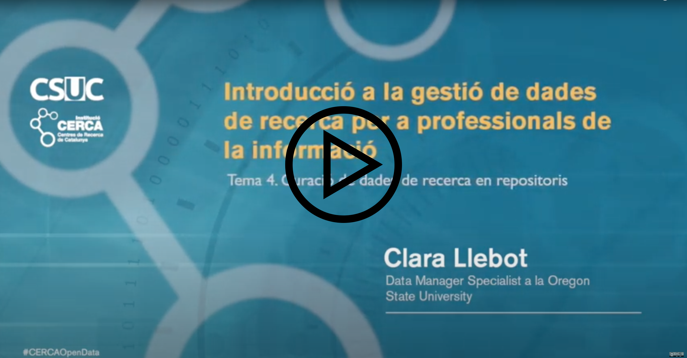

Aquesta lliçó conté el següent contingut:

* Curar dades en un repositori institucional
* El registre del repositori
* La documentació del conjunt de dades
* Curar dades de recerca quan no s'és expert en el tema

Podeu mirar el vídeo, o llegir aquesta pàgina, hi ha el mateix contingut. La única diferència és que a la lliçó escrita trobareu uns quants exercicis sobre llicències (en requadres taronja). El vídeo dura 29 minuts.

# Curar dades en un repositori institucional

Aquest tema està enfocat a la curació de dades per a un repositori institucional que accepta documents rellevants per a la institució (per exemple tesis, informes, materials docents, etc.) i que també accepta dades de recerca dels investigadors de la universitat. Els conceptes de què parlarem es poden aplicar fàcilment a altres repositoris, però la rigidesa o flexibilitat amb què s'apliquen és una cosa que s'ha de decidir segons els objectius del repositori.
 
Des del meu punt de vista una de les funcions més útil del repositori institucional és donar el servei de repositori per aquelles situacions en què altres repositoris existents no són adequades. Per exemple, per investigadors que treballen en un camp d'investigació per al qual no hi ha un repositori de referència. Els repositoris institucionals també poden donar un servei en concret, com ara acceptar conjunts de dades que són especialment grans, i que normalment no s'accepten en repositoris de disciplines concretes (tot i que en aquest cas, és clar, la biblioteca necessitarà tenir els recursos necessaris per poder oferir alguna cosa així). Un repositori institucional també per donar suport a aquells investigadors que no es troben còmodes compartint dades, i prefereixen fer-ho amb algú de confiança, de la seva pròpia universitat, que els pugui guiar. És a dir, el procés de revisió també pot tenir un objectiu docent: formar els investigadors sobre com compartir dades i com dipositar dades d'investigació.

Els dipòsits institucionals tendeixen a acceptar dades de disciplines molt diverses, encara que per descomptat hi ha excepcions (per exemple, el cas d'institucions de recerca d'un àmbit concret que acceptaran dades només d'aquest àmbit). Al meu entendre un repositori generalista haurà de ser més flexible que altres repositoris centrats en una disciplina. Per exemple, és molt difícil escollir un tipus d'estàndard de metadades o format de dades, i obligar a tots a usar-los. Aquests estàndards i formats són normalment específics per a una disciplina, i si esperem dades de moltes disciplines diferents no té sentit que sigui obligatori fer servir un format en concret.

És recomanable que el repositori tingui uns objectius clars, i que desenvolupi una política de com es tractaran les dades. Algunes de les preguntes a treballar per desenvolupar aquestes polítiques poden ser ([Green et al, 2009](https://www.coar-repositories.org/files/guide.pdf))
* Els objectius i missió del repositori
* El tipus de dades que el repositori accepta
* L'estat de les dades que el repositori accepta. Les dades passen per un cicle que va de dades brutes a dades llestes per compartir amb el públic.
* Versions. Si hi ha diferents versions d'un mateix conjunt de dades, com es tractaran en el repositori.
* Formats. Quins formats s'acceptaran?
* Limitacions de nombre de fitxers o volum de dades que es vulguin imposar.
* Quin tipus de metadades es generaran i preservaran

En lliçons anteriors hem parlat de com curar i organitzar les dades. Aquí parlarem de com curar les metadades, i distingirem entre dos tipus de metadades.
* **El registre**: les metadades que formen part del repositori, que poden ser descriptives, administratives o estructurals. Algunes d'aquestes metadades seran accessibles només per a aquells que mantenen el repositori, altres seran visibles per al públic. Per a aquesta explicació ens centrarem en les metadades que normalment gestionen els bibliotecaris o tècnics que curen dades, i que són visibles per als usuaris (títol, autors, abstract, etc.).
* **La documentació**: fitxers que expliquen detalladament el contingut de les dades, i en donen el context necessari per poder entendre-les.

# El registre del repositori

La major part de les metadades del repositori es gestionen de la mateixa manera en un registre de dades que en un registre d'altres tipus de contingut. Quan tractem amb dades hem de posar especial atenció en els següents elements.

### Llicències

Com ja hem vist, un dels elements essencials per publicar dades en accés obert (o no) correctament és assegurar-nos que les dades estiguin publicades amb una llicència. El punt R1.1. dels principis FAIR també ho deixa clar: hem de "publicar dades i metadades amb una llicència de reutilització clara i accessible."

La manera com les llicències funcionen amb dades és molt semblant a com funcionen per a altres tipus de materials. Parlem de les llicències Creative Commons, que son unes de les llicències més habituals.

Generalment recomanem publicar dades en obert sota una llicència CC0, perquè és la llicència més oberta, i que permetrà que les dades siguin reutilitzades sense traves.

> ## Llicència CC0
> 
> La llicència CC0 implica que (font: [la pàgina web de Creative Commons](https://creativecommons.org/publicdomain/zero/1.0/deed.ca)):
* La persona que ha associat una obra amb aquest document l'ha entregada al domini públic mitjançant la renúncia de tots els drets sobre l'obra pel que fa a la propietat intel·lectual, incloent-hi els drets afins, fins on és possible amb la llei vigent aplicable.
* Podeu copiar, modificar, distribuir l'obra i fer-ne comunicació pública, fins i tot amb finalitat comercial, sense demanar cap mena de permís.
> 
{: .callout}

És a dir, aquesta llicència bàsicament diu que si el creador té drets d'autor sobre les dades, hi renuncia. A molts investigadors els preocupa que si les dades estan sota una llicència CC0, ningú els citarà, perquè la llicència no inclou l'obligatorietat de reconèixer l'autoria de les dades. En general no és un problema, perquè la qüestió de citar fonts en el món acadèmic és una qüestió ètica, no legal. En el món acadèmic s'han de citar les fonts sigui quina sigui la llicència. No fer-ho és plagiarisme. Citar dades dóna credibilitat als estudis que les reutilitzin, i generalment tots els acadèmics citen de forma rutinària sense problema. Parlarem més de citar dades d'aquí un moment. Fora del món acadèmic sí que qualsevol persona podria fer servir les dades sense citar-les.

La resta de llicències de Creative Commons totes tenen el requisit del reconeixement. La llicència més simple és la CC-BY, en què l'únic requisit és el reconeixement.

> ## Llicència CC-BY
> 
> La llicència CC-BY implica que (font: [pàgina web de Creative Commons](https://creativecommons.org/licenses/by/4.0/deed.ca).)
* Sou lliure de Compartir — copiar i redistribuir el material en qualsevol mitjà i format.
* Sou lliure d'Adaptar — remesclar, transformar i crear a partir del material per a qualsevol finalitat, fins i tot comercial. 
* Amb els termes de Reconeixement — Heu de reconèixer l'autoria de manera apropiada, proporcionar un enllaç a la llicència i indicar si heu fet algun canvi. Podeu fer-ho de qualsevol manera raonable, però no d'una manera que suggereixi que el llicenciador us dóna suport o patrocina l'ús que en feu.
> 
{: .callout}

Les llicències Creative Commons no són un bon mecanisme per obligar algú a fer alguna cosa amb les dades (per exemple, reconeixer autoria) si la llei en permet un ús més ampli (com ara usar les dades sense haver de donar informació sobre l'autoria). En molts casos, si les dades no estan protegides pels drets de propietat intel·lectual, la llei no obliga a reconèixer autoria. Malgrat això, és cert que en molts casos tenir una llicència que requereix reconeixement anima als usuaris a fer-ho, i els investigadors i investigadores que han creat les dades es queden més tranquils. Molts repositoris accepten la publicació de dades amb llicències CC-BY per aquest motiu, i és força comú trobar-se conjunts de dades publicats amb una llicència CC-BY.

> ## Lectures recomanades
>
> Si voleu llegir més sobre la idoneitat de llicències CC-BY per dades, vegeu una discussió a la pàgina web de la Universitat de Califòrnia (en anglès) a [https://osc.universityofcalifornia.edu/2016/09/cc-by-and-data-not-always-a-good-fit/](https://osc.universityofcalifornia.edu/2016/09/cc-by-and-data-not-always-a-good-fit/)
{: .challenge}

Les llicències Creative Commons poden tenir altres termes a part del Reconeixement.

> ## Termes de les llicències Creative Commons
> 
> * **CompartirIgual** — Si remescleu, transformeu o creeu a partir del material, heu de difondre les vostres creacions amb la mateixa llicència que l'obra original. (font, [aquí](https://creativecommons.org/licenses/by-sa/4.0/deed.ca))
> * **SenseObraDerivada** — Si remescleu, transformeu o creeu a partir del material, no podeu difondre el material modificat. (font, [aquí](https://creativecommons.org/licenses/by-nd/4.0/deed.ca))
> * **NoComercial** — No podeu utilitzar el material per a finalitats comercials. (font, [aquí](https://creativecommons.org/licenses/by-nc/4.0/deed.ca))
> 
{: .callout}

Tot i que en principi pot semblar que aquests termes no fan cap mal, en realitat posen traves i compliquen la reutilització de les dades. Per exemple:
* En el cas del terme **NoComercial**, que és atractiu per molts investigadors, cal tenir en compte que la definició de "Comercial" no és gaire concreta. Hi ha finalitats que es poden considerar comercials sota aquesta llicència que són comuns al món acadèmic, com ara la publicació d'un llibre, o que moltes persones veuen intuitivament com a "bones" i que no voldrien prohibir, com ara l'ús de les dades per part d'organitzacions humanitàries o ONGs.
* En casos en què un investigador o investigadora està compilant dades de moltes fonts, pot ser realment difícil fer un seguiment de les restriccions d'unes dades respecte les altres. I en el cas de **CompartirIgual** obligaria a compartir totes les dades resultants sota una llicència restrictiva, independentment de les llicències de les altres.

En general és una bona idea mantenir aquest termes al mínim, a no ser que hi hagi un bon motiu.

> ## Lectura recomanada
>
> Si voleu saber més detalls sobre propietat intel·lectual i dades aquest article (en anglès) té tots els detalls sobre la protecció legal per conjunts de dades, qui té els drets, i com s'apliquen en el context de compartir dades de recerca:
Carroll, M. W. (2015). Sharing Research Data and Intellectual Property Law: A Primer. PLoS Biology, 13(8). [https://doi.org/10.1371/journal.pbio.1002235](https://doi.org/10.1371/journal.pbio.1002235)
> 
{: .challenge}

Ja hem vist que les dades de recerca poden ser de molts tipus, i un d'aquests tipus, força comú, és codi. Quan parlem de codi o software, o programari en aquest context ens referim a scripts o programes que els investigadors o investigadores generen, i que s'usen per netejar les dades, o per analitzar-les, visualitzar-les, per calcular-ne estadístiques, per generar dades secundàries, etc. Per exemple, en recerca s'utilitzen molt els llenguatges de programació Matlab, R i Python, tot i que hi ha molts llenguatges de programació que es fan servir en diferents contextos i àmbits de recerca.

Les llicències Creative Commons no es recomanen per publicar codi perquè no inclouen informació sobre la redistribució del programari, perquè no inclouen informació sobre possibles patents, i perquè les llicències Creative Commons no són compatibles amb les llicències de software que es fan servir actualment, així que són difícils d'integrar (podeu llegir el raonament [a les FAQ de la pàgina web del Creative Commons](https://creativecommons.org/faq/#can-i-apply-a-creative-commons-license-to-software)). Enlloc de llicències Creative Commons es recomana usar llicències de programari.

Podeu trobar llistes de llicències de programari obertes a
* Open Source Initiative: [https://opensource.org/licenses](https://opensource.org/licenses)
* Free Software Foundation: [https://www.gnu.org/licenses/license-list#SoftwareLicenses](https://www.gnu.org/licenses/license-list#SoftwareLicenses)

La llicència [MIT](https://opensource.org/licenses/mit-license.php) i la llicència [Apache 2.0](https://www.apache.org/licenses/LICENSE-2.0) són obertes, i molt usades. 

> ## Recurs
> 
> Aquest selector de llicències és molt útil per triar llicències de dades i de programari. [https://ufal.github.io/public-license-selector/](https://ufal.github.io/public-license-selector/). Els autors són Pawel Kamocki, Pavel Straňák i Michal Sedlák, de l'Institute of Formal and Applied Linguistics.
> 
{: .callout}

> ## Exercici
>
> Quina llicència triaria una investigadora que volgués publicar un conjunt de dades protegit per drets d'autor. La investigadora és qui té els drets d'autor, i vol publicar les dades tan obertament com sigui possible, permetent als altres fer treballs derivats, fins i tot per fins comercials.
> 
> Recordeu que podeu fer servir el [selector de llicències](https://ufal.github.io/public-license-selector/). 
> 
> > ## Solució
> >
> > L'opció per publicar les dades tan obertament com sigui possible seria aplicar una llicència CC0, per posar les dades en domini públic. Tothom podrà usar les dades, crear-ne derivades, i reutilitzar les dades sense restriccions. 
> >
> {: .solution}
{: .challenge}

> ## Exercici
>
> Quina llicència triaria un investigador que volgués publicar un conjunt de dades protegit per drets d'autor del qual no n'és propietari? L'investigador va obtenir el conjunt de dades original d'un repositori, on apareixien sota una llicència CC-BY-ND.
> 
> Recordeu que podeu fer servir el [selector de llicències](https://ufal.github.io/public-license-selector/). 
> 
> > ## Solució
> >
> > Aquest investigador no pot publicar aquest conjunt de dades, perquè les dades originals estan publicades sota una llicència CC-BY-ND, i aquesta llicència no permet la creació d'obres derivades. Per poder publicar les dades l'investigador s'hauria de posar en contacte amb els autors i demanar permís.
> >
> {: .solution}
{: .challenge}

> ## Exercici
>
> Quina llicència triaria una investigadora que volgués publicar un conjunt de dades que consisteix en fets observables, no creatius, i no protegits per drets d'autor? A la investigadora li agradaria limitar l'ús de les dades a usos no comercials.
> 
> Recordeu que podeu fer servir el [selector de llicències](https://ufal.github.io/public-license-selector/). 
> 
> > ## Solució
> >
> > Si les dades no estan protegides per drets d'autor, un cop es facin públiques passaran a ser de domini públic. Les dades s'haurien de publicar amb un Public Domain Mark. Això és el que recomanaríem des del punt de vista de posar les dades en obert. Si la investigadora es vol assegurar que no es facin servir per usos comercials el sistema de distribució de les dades hauria de ser tal en què els usuaris es comprometin a no fer-ne un ús comercial, però publicar-les amb una llicència Creative Commons no seria adequat, perquè aquestes llicències no estan dissenyades per afegir condicions contractuals a les dades. La majoria de repositoris no ofereixen aquesta possibitat. 
> >
> {: .solution}
{: .challenge}

> ## Exercici
>
> Una estudiant de doctorat ha creat un model amb R que vol publicar amb la seva tesi doctoral. Vol fer la reutilització de les dades tan fàcil com sigui posible, i no creu que sigui necessari que els altres hagin d'utilitzar la mateixa llicència quan reutilitzen el codi.
> 
> Recordeu que podeu fer servir el [selector de llicències](https://ufal.github.io/public-license-selector/). 
> 
> > ## Solució
> >
> > Hi ha moltes llicències disponibles. Entre elles, la Llicència MIT, o la Llicència Apache 2. 
> >
> {: .solution}
{: .challenge}

### Camps descriptius que descriguin el conjunt de dades

Un error comú que els investigadors cometen és descriure el conjunt de dades amb el mateix títol, autors, abstract, etc. que l'article a què es refereixen. Això és un error. Les metadades han de descriure les dades, no l'article.
* L'abstract ha de ser una descripció dels materials en el registre, no de la interpretació de les dades.
* El títol també ha de descriure les dades. De vegades els investigadors posen la cita de l'article en el títol de les dades. Un títol és un títol, no una cita. 
* Els autors per descomptat poden ser els mateixos en l'article que en el conjunt de dades, però no tenen per què ser-ho. Publicar les dades per separat és una oportunitat excel·lent per donar crèdit a les persones que han treballat en la recollida de dades, però que no van com a coautors en l'article.

### DOI

El DOI és el Digital Object Identifier, una sèrie de caràcters alfanumèrics que identifiquen de forma única a el conjunt de dades. Un DOI és persistent i conté metadades de l'objecte. La majoria d'agències finançadores, revistes científiques etc requereixen que els conjunts de dades en repositoris tinguin un DOI. És important que el repositori tingui la capacitat de generar un DOI (o un altre identificador únic i persistent) per a cada conjunt de dades, i aquest DOI ha d'estar documentat en el registre. 

### La cita recomanada

No tots els investigadors estan familiaritzats amb dades d'investigació publicade s en obert, i alguns mai han citat dades en els seus articles, i no estan segurs de com fer-ho.

Per facilitar a altres investigadors el citar les dades correctament és útil incloure la cita en un dels camps del registre.

### Altra informació

És important que les dades continguin totes les metadades necessàries per ser útils. Tot i això, està clar que els investigadors estan acostumats a fer servir articles científics com a unitat estàndard d'informació científica. Si hi ha articles, llibres, o altres materials relacionats amb les dades, és important afegir aquesta informació al registre.

# La documentació del conjunt de dades

El més important a destacar pel que fa a la documentació és que és imprescindible que estigui present. Cap conjunt de dades s'ha de publicar sense algun tipus de documentació, la documentació hauria de ser **obligatòria**.
 
Una part de la documentació inclou **aspectes generals**, que són elements que ja havíem inclòs en el registre, i que poden estar augmentats. Per exemple, el registre inclou els autors. En la documentació podem llistar els autors i afegir altra informació extra que pot no aparèixer en el registre, com ara l'identificador ORCID de l'investigador (en el cas que no hi hagi registre d'autoritats al repositori), l'afiliació, informació de contacte com l'adreça de correu electrònic, el paper que l'autor va exercir en la creació del conjunt de dades, etc. És important repetir aquesta informació perquè l'investigador que decideixi descarregar les dades la tingui, fins i tot si no ha tingut la previsió de guardar la informació present al registre.

Una altra part de la documentació pot ser altra informació extra que no és al registre, com ara una llista de les variables mesurades, i la seva definició. O detalls sobre els instruments utilitzats per fer les mesures. O una descripció detallada dels mètodes. Hi ha un munt de coses!

A continuació, alguns dels elements que hem de tenir en compte en crear (o revisar) la documentació del conjunt de dades.

### Consistència de les metadades del registre i la documentació del conjunt de dades

Sembla que no calgui dir-ho, però la informació que hi ha repetida entre el registre i el conjunt de dades ha de ser consistent. El títol ha de ser el mateix. Els autors han de ser els mateixos. La llicència ha de ser la mateixa. Etcètera. A la pràctica, si demanem la informació dues vegades, moltes vegades (moltes!) aquesta informació no és consistent, i s'ha de corregir.

### Format de la documentació

El format de la documentació ha de seguir les mateixes normes que el format de les dades, han de complir els principis FAIR. Si hi ha un estàndard que sigui adequat, s'ha d'utilitzar. Podeu trobar una llista d'estàndards de metadades de recerca en directori de metadades de la Research Data Alliance [http://rd-alliance.github.io/metadata-directory/standards/](http://rd-alliance.github.io/metadata-directory/standards/)

A la pràctica moltes vegades és difícil utilitzar un estàndard de metadades, sobretot si treballem amb un repositori agnòstic. Si no hi ha un estàndard que sigui adequat es pot crear un simple fitxer de text amb la informació necessària. És obert, i fàcil de generar. Moltes vegades aquests fitxers es diuen "readme". Podeu trobar un exemple de plantilla de readme en [aquest enllaç](https://raw.githubusercontent.com/osulp/Data-Management-Templates-Project/master/Documentation_Template/Documentation_Template.txt). És una versió adaptada a la Oregon State University d'una plantilla que fan servir molts repositoris institucionals.

### Informació de contacte

Idealment les persones que reutilitzin les dades no necessitaran contactar a l'autor, perquè tota la informació estarà clarament explicada en la documentació. Però per si de cas, és important especificar en la documentació qui és la persona de contacte a qui enviar preguntes, si n'hi ha. La informació de contacte ha de ser tan persistent com sigui possible. Per exemple, si les dades kes està dipositant un estudiant de doctorat a punt d'acabar la seva tesi, l'adreça de correu electrònic de la universitat pot no ser el contacte més durador. Algunes solucions possibles són proporcionar una altra adreça de correu electrònic, o afegir una segona persona de contacte que tingui una posició permanent a la universitat, o tenir un perfil obert de ORCID mitjançant el qual es pugui contactar.

### Enllaços robustos

Els enllaços en un fitxer de documentació han de ser el més robustos possible. Això vol dir:
* En curar les dades ens assegurarem que tots els enllaços funcionen.
* També ens assegurarem que, quan sigui possible, portin a continguts oberts. Per exemple, si hi ha un article que analitza i explica les dades, l'article hauria d'estar citat en la documentació. Si hi ha una versió de l'article en obert, i una versió que no està en obert, en la documentació hauríem d'incloure com accedir a la versió en obert.
* També valorarem si els enllaços van a materials que esperem que perdurin en el temps.

### Llista de fitxers

Si el conjunt de dades té més d'un fitxer de dades s'ha d'incloure una descripció del contingut de cada un dels fitxers o carpetes.

### Diccionari de dades

Com hem vist en la lliçó anterior, en el cas de dades en forma tabular és important incloure en la documentació la descripció de cadascuna de les variables. Tot i que els títols de les columnes semblin clars, han de definir-se. També inclourem unitats, i tota la informació necessària per interpretar les dades, com una llista de valors possibles per a una determinada variable (per exemple, si hi ha una variable que sigui "color", quins són els valors acceptables?), definicions d'acrònims, o valors nuls.

### Mètodes

La documentació ha d'incloure informació sobre com es van recol·lectar les dades, quins protocols es van fer servir, quin control de qualitat es va aplicar, com es van analitzar les dades, etc. És molt comú que els investigadors vulguin citar un article publicat en comptes de reescriure tots els mètodes. Això és acceptable, però en aquest cas és especialment important comptar amb una versió en obert de l'article, perquè sense aquesta informació la utilitat de les dades queda notablement reduïda. Crec que és important explicar als investigadors que un conjunt de dades és l'oportunitat perfecta per afegir tota aquella informació que no hem pogut incloure en la secció de mètodes de l'article. 

# Curar dades quan no s'és expert en el tema

Les guies d'aquest tema parteixen de el supòsit que el curador de dades no és un expert en la disciplina de les dades que està curant. Ser expert en la matèria ajudarà molt el curador. Per als que no som normalment experts en la matèria de les dades que curem, els recursos desenvolupats pel Data Curation Network són molt útils.
 
El Data Curation Network és un projecte que ha desenvolupat (i continua desenvolupant) una sèrie de guies, anomenades "primers" que contenen informació que ajuda a un curador a avaluar un conjunt de dades del qual no és expert. Conté informació sobre el tipus de fitxers, com obrir-los, i els requisits que recomanen que es compleixin per ser acceptats en un repositori.

Passeu uns minuts explorant el contingut d'aquests primers, per utilitzar-los com a referència quan ho necessiteu [https://datacurationnetwork.org/outputs/data-curation-primers/](https://datacurationnetwork.org/outputs/data-curation-primers/).

Un altre element molt útil del Data Curation Network és que han desenvolupat una llista d'accions que un curador realitza en revisar un conjunt de dades. Podeu accedir a aquesta llista amb aquest enllaç: [https://datacurationnetwork.org/outputs/workflows/](https://datacurationnetwork.org/outputs/workflows/) És una llista molt més detallada del que hem revisat en aquests tema, si us plau reviseu-la també com a part d'aquesta lliçó. No tots els elements d'aquesta llista son adequats per a un determinat repositori (per exemple, en el meu cas, no tenim recursos suficients per assegurar-nos que el codi que els investigadors dipositen en el nostre repositori es pot compilar i executar correctament), però crec que és interessant tenir-la en compte quan creeu vostra pròpia llista d'elements a considerar en els vostres repositoris.

# Referències

Green, A., MacDonald, S., & Rice, R. (2009). Policy-making for Research Data in Repositories: A Guide. Data Information Specialists Committee. [https://www.coar-repositories.org/files/guide.pdf](https://www.coar-repositories.org/files/guide.pdf)
