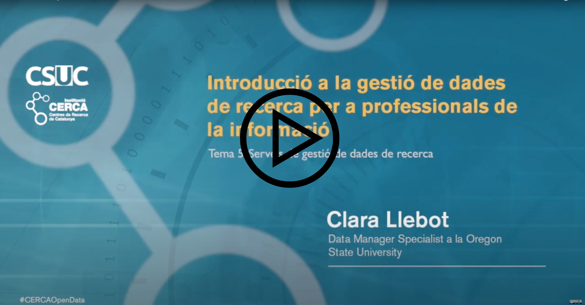

Aquesta lliçó conté el següent contingut:

* Serveis de recolzament a la gestió de dades de recerca en institucions i biblioteques.
* Un exemple de serveis de suport a la gestió de dades
* Mantenir-se al dia i aprendre sobre gestió de dades de recerca

La primera secció està en vídeo i en text, podeu mirar el vídeo (els primers 7 minuts), o llegir aquesta pàgina, hi ha el mateix contingut. La segona secció només està en vídeo (del minut 7 al minut 21). La tercera només està en text, perquè es tracta d'una llista de recursos. El vídeo dura un total de 21 minuts.

# Serveis de recolzament a la gestió de dades de recerca en institucions i biblioteques.

En aquesta lliçó farem una mirada breu als serveis que les biblioteques de l'entorn del món han organitzat per donar suport als investigadors i institucions en les tasques de gestió de dades.
 
Encara que ens centrarem en serveis desenvolupats per biblioteques és important dir que les biblioteques no són les úniques que presten aquest tipus de serveis, i moltes vegades ho fan en col·laboració amb, per exemple, els departaments d'informàtica o els centres de suport a la investigació de la institució.
 
Hi ha diversos articles que descriuen els tipus de serveis oferts per universitats al voltant de el món en els últims anys ([Cox et al, 2017](https://doi.org/10.1002/asi.23781), [Tenopir et al, 2015](https://doi.org/10.7191/jeslib.2015.1085), [Rans et a al 2017](http://www.dcc.ac.uk/resources/how-guides/RISE#4), [Lewis 2010](https://doi.org/10.29085/9781856048750.011)). La majoria d'aquests articles els classifica entre Informació i consultes (un servei més tradicional) i serveis tècnics aplicats (serveis que requereixen ser més expert). En general, aquests són els serveis:
* Desenvolupament de polítiques institucionals de gestió de dades de recerca
* Revisió de plans de gestió de dades
* Consultes
* Instrucció i docència en forma de classes, tallers, etc
* Curar dades

És útil diferenciar, no només entre serveis d'Informació i consultes i serveis tècnics i aplicats, sinó entre serveis transversals, serveis a grups, i serveis a persones individuals. Consulteu la taula següent per veure les diferències entre ells a nivell d'inversió necessària, tipus de coneixement comunicat, i investigadors afectats.

 
| |Serveis transversals|Serveis a grups|Serveis a persones|
|:---------------------:|:---------------------:|:---------------------:|:---------------------:|
|Inversió necessària|Alt en temps i recursos. Quan en marxa, aplicació ràpida.|Mitjà. Unes quantes hores o setmanes|Relativament curt. Minuts o poques hores.|
|Tipus de coneixement comunicat|Coneixement generalitzable, s'ha d'interpretar en cada ocasió|Entre generalitzable i específic|Coneixement específic per a una aplicació concreta|
|Investigadors afectats|Tots els investigadors de la institució|Grup d'investigadors amb alguna cosa en comú|Una persona o grup petit|

### Exemples

Vegem-ne alguns exemples
* **Gestionar un repositori de dades**. Aquesta és una activitat que necessita una inversió de temps i de diners molt altes. Un cop està en marxa encara necessita manteniment i recursos, però cada vegada que s'usa (e.g. cada vegada que algú diposita un conjunt de dades) el procés és relativament ràpid. Un repositori pot afectar, potencialment, tots els investigadors i estudiants d'una institució.
* **Crear una sèrie de pàgines web amb informació sobre gestió de dades per a investigadors** també seria una activitat transversal. La inversió en aquest cas no és tan alta com el repositori, però una pàgina web ben feta requereix moltes hores de treball. El coneixement en aquest tipus de pàgines serà generalitzable, i cada investigador haurà d'interpretar com la informació afecta el seu projecte d'investigació. Potencialment tots els investigadors de la institució poden accedir i beneficiar-se de les guies.
* **Un taller recurrent per a estudiants de màster i doctorat en eines per gestionar dades** és un exemple de servei a grups. La preparació requerirà temps, però segurament no tant com els serveis transversals. Els continguts seran generals, però durant el transcurs de el curs caldrà respondre preguntes específiques, i el taller pot estar adaptat a perfils amb diferents necessitats. Un taller afectarà un grup que tenen una cosa en comú: interès per l'eina en qüestió.
* **Un servei a persones típic és una consulta en la qual un bibliotecari revisa un pla de gestió de dades d'un investigador**. El temps dedicat serien unes hores, i el coneixement seria molt adaptat a el projecte en particular. Afecta un nombre petit de persones, encara que en el cas de projectes grans pot afectar bastants investigadors.

Tot això són exemples, és clar, i podem trobar molts casos de serveis que no encaixen amb cap d'ells. Per exemple, una col·laboració amb un investigador en particular que requereixi molta inversió i temps.

> ## Lectura
> 
> Consulteu els tipus de serveis oferts per biblioteques de centres de recerca al món en aquests dos documents:
> * [Llebot i Rempel, 2020](https://ir.library.oregonstate.edu/concern/file_sets/8w32rc99c) (en català).
> * Apèndix F de [Cox et al 2016](https://doi.org/10.1002/asi.23781) (en anglès).
> 
{: .challenge}

# Un exemple de serveis de suport a la gestió de dades

Crec que pot ser útil veure un exemple específic de servei de dades de recerca en una institució concreta. El cas que conec millor és el de la biblioteca on treballo, així que us explicaré l'experiència de l'Oregon State University. Els recursos, prioritats i funcionament de cada biblioteca són diferents, així que només és un exemple, no necessàriament un model a seguir.
En ser només un exemple, el contingut està només en format de vídeo. Podeu accedir-hi anant al [vídeo que hi ha al principi d'aquesta pàgina](https://youtu.be/6Ux2mnMrJJM), i navegant directament al minut 6:50.

# Mantenir-se al dia i aprendre sobre gestió de dades de recerca

Parlem una mica de com ens mantenim al dia sobre gestió de dades. Aquí sota us deixo una llista de recursos que val la pena tenir en compte per mantenir-se al dia i aprendre sobre gestió de dades de recerca .

### Revistes i publicacions
* Journal of eScience Librarianship https://escholarship.umassmed.edu/jeslib/
* International Journal of digital curation http://www.ijdc.net/index
* Journal of the American Society for Information Science and Technology https://onlinelibrary.wiley.com/loi/15322890

### Blogs i guies online
* El blok de bid, en el qual es publiquen ressenyes d'articles i informes publicats sobre gestió de dades (i altres temes), en català i castellà http://www.ub.edu/blokdebid
* Digital Curation Center (DCC): el Regne Unit va ser un dels grans impulsors de la gestió de dades, i en aquesta pàgina web hi trobareu molts materials que són útils per començar serveis de gestió de dades. https://www.dcc.ac.uk/ 

### Associacions professionals
* La Research Data Alliance (RDA), internacional, molt recomanable, ser membre és gratuït. https://rd-alliance.org/
* Research Data Access and Preservation No té una geografia definida, però els seus components són sobretot d'Amèrica de Nord. Us podeu fer membres gratuits aquest any (acaben d'enviar un missatge avui 2021-06-21 dient que s'haurà de pagar per ser membres a partir d'ara) https://rdapassociation.org/
* Earth Science Information Partners (ESIP), sobre ciències de la terra i el medi ambient. https://www.esipfed.org/
* La vostra associació de professionals de la informació local, com ara el COBDC.

### Llistes de distribució on us podeu apuntar
* Research Data Management. Creada pel DCC, d'àmbit internacional, amb molts participants europeus. https://www.jiscmail.ac.uk/cgi-bin/webadmin?A0=RESEARCH-DATAMAN
* Datacure és un grup de bibliotecaris i bibliotecàries amb responsabilitats de gestió de dades, basats la majoria a Nord Amèrica, que tenen aquesta llista de distribució per a resoldre dubtes http://bit.ly/22sx7M8
* Les associacions professionals normalment també tenen llistes de distribució on es fan preguntes. Per exemple la Research Data Access and Preservation té una llista de distribució.

### Conferències i congressos
Força relacionat amb les associacions professionals, que normalment organitzen congressos.
* La Research Data Alliance té un congrés cada any en algun lloc del món. El plenari de la RDA serà al novembre del 2021, i serà virtual. https://www.rd-alliance.org/plenary-meetings/next-plenary. 
International Digital Curation Conference https://www.dcc.ac.uk/events/international-digital-curation-conference-idcc
* Research Data Access and Preservation Summit (a Estats Units) https://rdapassociation.org/
Digital Library Federation Forum (no és 100% de gestió de dades, però té un component) https://forum2020.diglib.org/
* Midwest Data Librarian Symposium (d'una regió d'Estats Units, en què normalment participen gent de tot Amèrica de Nord) https://mwdatalibrariansymposium.wordpress.com/
CSVconf, per gent a qui li encanta parlar de dades! Són a Estats Units, però tenen totes les presentacions penjades a Youtube. https://csvconf.com/ 
* Hi ha moltes conferències de disciplines concretes que inclouen unes quantes sessions sobre gestió de dades per a les disciplines. Si treballeu en una disciplina concreta val la pena mirar si hi ha contingut de gestió de dades.

### Altres recursos
* El CSUC, el Consorci de Serveis Universitaris de Catalunya té una àrea de ciència oberta en què inclouen gestió de dades de recerca. Ofereixen cursos i conferències sobre gestió de dades https://www.csuc.cat/ca/serveis/ciencia-oberta
* Una llista d'articles i altres materials de referència sobre curació de dades. Té més de 800 articles. Bailey, Charles W., Jr. Research Data Curation and Management Bibliography. Houston: Digital Scholarship, 2021. http://www.digital-scholarship.org/rdcmb/rdcmb.htm

# Referències 
Cox, A. M., Kennan, M. A., Lyon, L., & Pinfield, S. (2017). Developments in research data management in academic libraries: Towards an understanding of research data service maturity. Journal of the Association for Information Science and Technology, 68(9), 2182–2200. [https://doi.org/10.1002/asi.23781](https://doi.org/10.1002/asi.23781)

Llebot, C., Rempel, H. G. (2020) Instruments to explore the adoption of good data management practices through a variation of the UTAUT model. (Version 1) [Dataset]. Oregon State University. [https://doi.org/10.7267/5x21tn73z](https://doi.org/10.7267/5x21tn73z)

Tenopir, C., Allard, S., Frame, M., Birch, B., Baird, L., Sandusky, R., Langseth, M., Hughes, D., & Lundeen, A. (2015). Research data services in academic libraries: Data intensive roles for the future? Journal of EScience Librarianship, 4(2), e1085. [https://doi.org/10.7191/jeslib.2015.1085](https://doi.org/10.7191/jeslib.2015.1085)

Rans, J., & White, A. (2017). Using RISE, the research infrastructure self evaluation framework. Digital Curation Centre. [http://www.dcc.ac.uk/resources/how-guides/RISE#4](http://www.dcc.ac.uk/resources/how-guides/RISE#4)

Lewis, M. (2010). Libraries and the management of research data. In S. McKnight (Ed.), Envisioning Future Academic Library Services (1st ed., pp. 145–168). Facet. [https://doi.org/10.29085/9781856048750.011](https://doi.org/10.29085/9781856048750.011)

> ## Exercici
>
> Quins serveis ofereix la vostra universitat o centre de recerca? Funcionen bé? Identifiqueu dos o tres serveis que creieu que seria molt útil oferir a la vostra > institució. Per què heu escollit aquests serveis? Com funcionen els serveis que ja teniu? Quines són les necessitats que veieu més urgents?
> 
> Recordeu que podeu consultar les lectures recomanades per reflexionar sobre serveis
> * [Llebot i Rempel, 2020](https://ir.library.oregonstate.edu/concern/file_sets/8w32rc99c) (en català).
> * Apèndix F de [Cox et al 2016](https://doi.org/10.1002/asi.23781) (en anglès).
{: .challenge}

